# Design-002: Application Architecture (Clean Architecture)

## 1. Overview

This project implements a modular, scalable architecture inspired by **Clean Architecture** (also known as Onion or Hexagonal Architecture). This approach ensures a clear separation of concerns, high testability, and maintainability, and allows for an easy transition to microservices in the future.

---

## 2. Layered Structure

### **A. Presentation Layer (API/UI)**
- **Responsibility:** Handles HTTP requests, input validation, and response formatting.
- **Location:** `internal/handlers/`, `internal/routes/`
- **Notes:** No business logic or data access here.

### **B. Business Logic Layer (Services/Use Cases)**
- **Responsibility:** Orchestrates workflows, enforces business rules, coordinates between repositories and external services.
- **Location:** `internal/services/`, `internal/scheduler/`
- **Notes:** Depends on interfaces, not implementations.

### **C. Domain Layer (Entities/DTOs)**
- **Responsibility:** Contains core business entities, value objects, and domain logic.
- **Location:** `internal/handlers/*/dto.go`, `internal/repository/*/dto.go`
- **Notes:** No dependencies on other layers.

### **D. Data Access Layer (Repositories)**
- **Responsibility:** Handles all data persistence and retrieval (DB, cache, external APIs).
- **Location:** `internal/repository/`, `internal/cache/`, `internal/db/`
- **Notes:** Implements interfaces defined in the business logic layer.

### **E. Infrastructure Layer**
- **Responsibility:** Technical details (HTTP clients, email providers, third-party APIs).
- **Location:** `external/`, `internal/httpclient/`, `internal/notifier/`, `internal/weatherprovider/`
- **Notes:** Swappable implementations.

---

## 3. Dependency Direction

- **Outer layers depend on inner layers, never the reverse.**
- **Business logic depends on interfaces, not concrete implementations.**

---

## 4. Mapping to Current Codebase

| Layer           | Folder(s)                                                      | Key Responsibility                |
|-----------------|----------------------------------------------------------------|-----------------------------------|
| Presentation    | internal/handlers, internal/routes                             | HTTP, validation, response        |
| Business Logic  | internal/services, internal/scheduler                          | Orchestration, rules              |
| Domain          | internal/handlers/*/dto.go, internal/repository/*/dto.go       | Entities, DTOs, value objects     |
| Data Access     | internal/repository, internal/cache, internal/db               | Persistence, retrieval            |
| Infrastructure  | external/, internal/httpclient, internal/notifier, internal/weatherprovider | 3rd-party, adapters   |

---

### Architecture Diagram (SVG)

---

## 6. Microservices-Ready & Modular

- **Domain-driven structure:** Code is grouped by domain (feature) as well as by layer.
- **Interfaces everywhere:** All external dependencies (DB, cache, email, etc.) are abstracted behind interfaces.
- **Decoupled infrastructure:** Infrastructure code is in separate packages, making it easy to swap or extract.
- **Testing:** Business logic is unit-testable with mocks; infrastructure is tested with integration tests.
- **Independent deployment:** Each domain is self-contained, making it easy to extract as a microservice.

---

## 7. Summary

This architecture provides a robust foundation for maintainable, testable, and scalable software. It supports both monolithic and microservice deployments, and is designed for long-term evolution as requirements grow. 